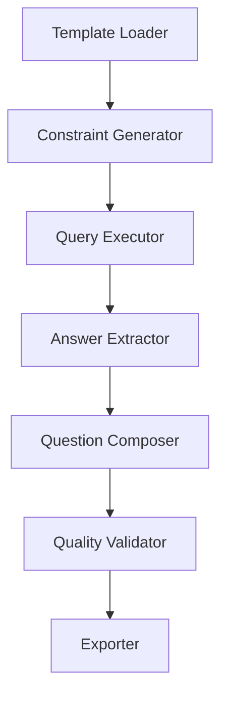

# Browsecomp-V3 系统架构设计

## 概览

Browsecomp-V3 是一个基于知识图谱的复杂学术问题生成器。其核心设计目标是通过多跳推理路径和约束匹配规则，自动从学术数据中提取并生成具有挑战性的问答对。

## 核心架构 - 管道模式

系统采用模块化管道架构，每个步骤都有明确的职责：

### 核心模块说明

1.  **`core/`**: 包含全局配置管理、类型定义和基础模型（使用 Pydantic 实现类型安全）。
2.  **`templates/`**: 推理链模板管理，支持 A-G 共 7 种学术推理模式。
3.  **`constraints/`**: 约束条件处理，将模板逻辑转化为具体的数据过滤规则。
4.  **`graph/`**: 基于 NetworkX 的图遍历模块，支持高效的实体和边查询。
5.  **`generator/`**: 问题生成核心，负责自然语言模板填充与句式丰富化。
6.  **`validator/`**: 质量验证模块，确保生成的问题具有唯一的确定性答案。
7.  **`output/`**: 多格式导出工具，支持 JSON 和 Markdown 输出。

## 关键特性

-   **多跳推理**: 支持 5-10 跳的复杂学术路径发现。
-   **约束驱动**: 映射了 30+ 种约束映射规则。
-   **鲁棒性**: 实现了线程安全的全局配置和完善的日志监控系统。
-   **可扩展性**: 插件式架构便于增加新的约束类型或生成模板。

---
*参考: [代码评审报告](file:///wsl$/Ubuntu/home/huyuming/projects/browsecomp-V3/docs/reports/CODE_REVIEW_REPORT.md)*
